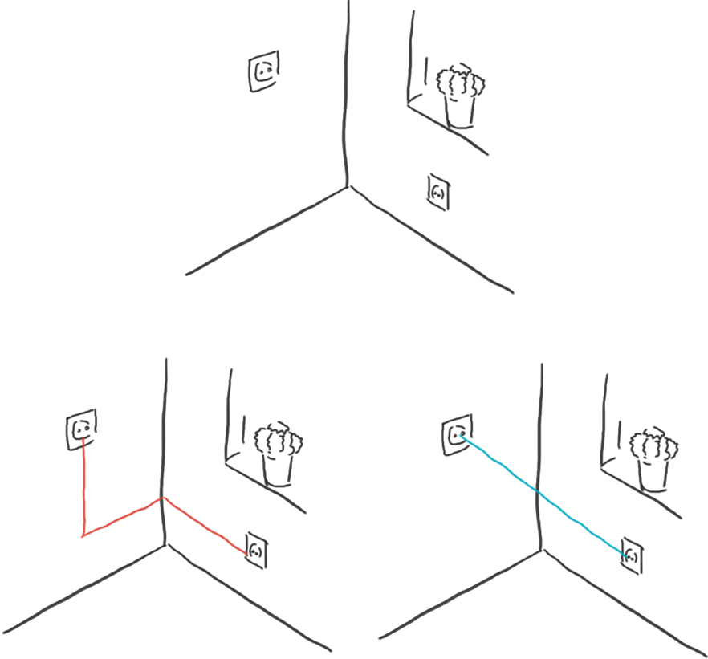

# Distanzmetriken

Es gibt viele verschiedene Möglichkeiten den Abstand zwischen zwei Punkten zu messen.
Wie könnte man z.B. im folgenden Bild den Abstand der beiden Steckdosen messen?

Es wäre sowohl möglich mit dem Manhattenmaß (rot) den Abstand an der Wand zu messen,
aber es wäre auch möglich mit derm euclidischen Maß den Abstand als Luftlinie (blau)
zu messen. Welches der beiden Abstandsmaße das richtige ist, hängt vom Anwendungsfall ab.
Beides sind jedoch erlaubte Werkezuge um Abstände zu messen.

Es gibt eine unendliche Anzahl an Möglichkeiten den Abstand zwischen Punkten zu messen.
Manchmal ist vorher möglich ein sinnvolles zu definieren, oft muss dieses aber als ein 
Hyperparameter ausprobiert werden.

## Was ist ein Distanzmaß
Im Folgenden sind die Regeln genannt, nach denen eine Funktion als ein Abstandmaß gilt:

## Beispiele für Abstandmaße

